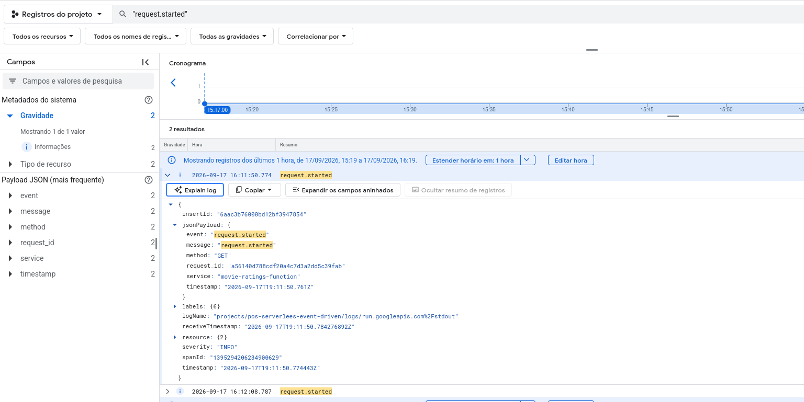
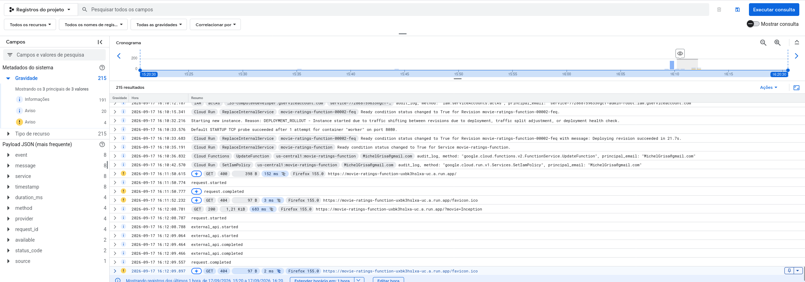

# Checkpoint 4 - Observabilidade da Movie Ratings Function

Esta função em Node.js recebe o nome de um filme e retorna as notas obtidas no TMDB e no OMDb. Nesta etapa, o serviço e o Workflow foram instrumentados com logging estruturado para o Google Cloud Logging. Os campos `event`, `severity`, `status_code`, `source` e `duration_ms` permitem criar métricas no Google Cloud Monitoring sem registrar chaves ou o título pesquisado.

## Requisitos

- Node.js
- GCP (Google Cloud Platform)
- GCP Workflows habilitado
- Chaves de API do TMDB e OMDb
- Variáveis de ambiente configuradas em um arquivo .env
- Google Cloud SDK autenticado (`gcloud auth login`)

## Estrutura

- `index.js` - função HTTP/Cloud Function em Node.js
- `workflow.yaml` - workflow do GCP para orquestrar chamadas externas
- `.env` - variáveis locais sensíveis
- `.env.example` - modelo para configuração local
- `.gitignore` - garante que senhas e chaves não entrem no Git
- `.env.example` - modelo sem credenciais reais

## Variáveis de ambiente

Copie o modelo e ajuste os valores:

```bash
cp .env.example .env
```

Exemplo:

```env
PORT=3000
TMDB_API_KEY=seu_token_tmdb
OMDB_API_KEY=seu_token_omdb
USE_GCP_WORKFLOW=false
WORKFLOW_ENDPOINT=https://workflowexecutions.googleapis.com/v1/projects/SEU_PROJETO/locations/REGION/workflows/NOME_DO_WORKFLOW/executions
GCP_PROJECT_ID=seu_projeto_gcp
GCP_REGION=us-central1
```

## Executar localmente

```bash
npm install
npm start
```

Exemplo de chamada:

```bash
curl "http://localhost:3000/?movie=Inception"
```

## Como a função funciona

1. A função recebe o parâmetro `movie` na URL ou no corpo da requisição.
2. Verifica se `USE_GCP_WORKFLOW=true`.
3. Se estiver habilitado, invoca um Google Cloud Workflow.
4. Senão, chama as APIs do TMDB e OMDb diretamente.
5. Emite eventos JSON de início, conclusão e erro, com latência e códigos de status.
6. Retorna um JSON contendo as avaliações e metadados do filme.

## Observabilidade implementada

Os logs são escritos em stdout como JSON, formato ingerido automaticamente pelo Cloud Logging. Exemplos de eventos emitidos:

- `request.started` e `request.completed`: ciclo da requisição, status, origem e duração.

Exemplo de um evento estruturado no Cloud Logging:



- `external_api.started`, `external_api.completed` e `external_api.failed`: TMDB e OMDb, disponibilidade, status e duração.
- `workflow.started`, `workflow.completed` e `workflow.failed`: execução, estado, quantidade de polls e duração.

Visão consolidada dos eventos gerados pela função:



O título do filme e as chaves de API não são incluídos nos logs. O `request_id` facilita correlacionar os eventos de uma chamada.

## Resumo das otimizações propostas


 **Adicionar cache por título normalizado:** consultas repetidas ao mesmo filme fazem chamadas desnecessárias ao TMDB e ao OMDb. Um cache com TTL, usando Memorystore ou Firestore conforme o volume, reduziria latência, consumo de APIs externas e risco de atingir limites. 
